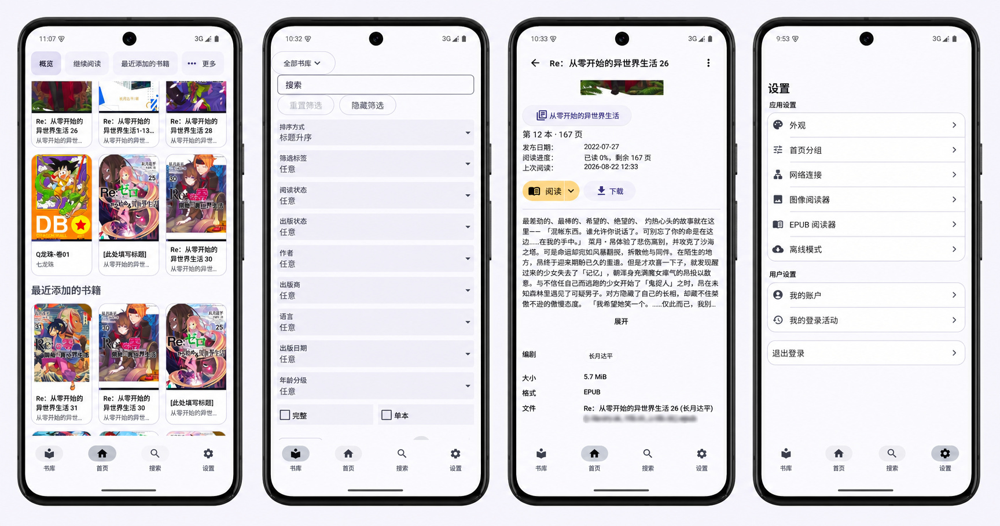

# Komelia Intl

[English](README.md) | [简体中文](README_zh-CN.md)

[](https://github.com/SakuraSM/KomeliaIntl/releases/latest)
[](LICENSE)

Komelia Intl 是 [Komelia](https://github.com/Snd-R/Komelia) 的 `SakuraSM/KomeliaIntl` 分支版本。Komelia 是 [Komga](https://komga.org/) 媒体服务器的跨平台客户端。本仓库增加了简体中文、自适应界面、阅读器问题修复和独立发布支持。

使用本应用前，你需要一个可以访问的 Komga 服务器和 Komga 账号。本仓库不包含 Komga 服务端。

## 本仓库的重要改动

### UI 优化

本仓库重新设计了一级导航、首页分组、书库筛选、搜索、设置和详情页，使其适配手机与宽屏。Light、Dark 和 OLED 主题共用间距、颜色、圆角与动效规则，界面同时支持 reduced motion 和键盘焦点。

### 远程与本地网络动态切换

你可以配置主要远程地址和可选的局域网地址。启用自动切换后，Komelia 会检测局域网地址。局域网可用时优先连接，不可用时继续使用主要远程地址。Android 会在网络状态变化后重新检测。

### 本地下载与离线阅读

在受支持的原生平台，你可以下载书籍，按系列、书籍或媒体类型查看本地缓存，并删除缓存内容。下载后的 CBZ、CBR、PDF 和 EPUB 文件可在离线模式中继续阅读。

## 其他改动

- 增加跟随系统、English 和简体中文三种应用内语言选项。Compose 界面、Android 系统页面和 EPUB 控件会使用所选语言。
- 修复图片与 EPUB 阅读器的控制栏、页面重试、进度拖动和返回行为。
- 应用更新使用本仓库的 Release，并同时展示本仓库和上游 Komelia 的公告。

## 主要功能

- 浏览书库、合集和阅读列表，搜索并筛选系列与书籍。
- 使用内置图片阅读器和 EPUB 阅读器打开 CBZ、CBR、PDF 与 EPUB 文件。
- 编辑系列和书籍元数据，并通过 Komf 完成受支持的元数据处理。

## 维护说明

本项目由我个人独立维护。我会持续跟进并同步上游 Komelia 的改动，以约一周一个迭代为目标。迭代时间会根据上游改动规模、测试结果和个人时间调整。感谢使用 Komelia Intl。

## 支持的平台

源码包含下列构建目标。每个 GitHub Release 只会附带该版本实际构建的平台，请以 Release 页的 **Assets** 列表为准。

| 平台 | Gradle 任务 | 常见产物 |
|---|---|---|
| Android | `androidRelease` | APK |
| Windows x86_64 | `desktopMsi` | MSI |
| Linux x86_64 | `desktopDeb` | DEB |
| macOS | `desktopDmg` | DMG |
| 当前操作系统的桌面端 | `desktopJar` | JAR |
| 浏览器、WebAssembly | `komfWebUI` | 静态网页文件 |
| Chrome 版 Komf 扩展 | `komfExtensionChrome` | ZIP |
| Firefox 版 Komf 扩展 | `komfExtensionFirefox` | ZIP |

## 下载应用

- [下载 Komelia Intl 最新版本](https://github.com/SakuraSM/KomeliaIntl/releases/latest)
- [查看 Komelia Intl 全部版本](https://github.com/SakuraSM/KomeliaIntl/releases)

本仓库的独立 Android 版本使用包名 `io.github.zhengningning.komelia` 和本仓库的签名证书。Android 无法直接覆盖由其他发布者签名的安装包。如果安装时提示签名冲突，请先卸载其他版本，或继续使用原来的发布渠道。

[上游 Releases](https://github.com/Snd-R/Komelia/releases)、[Google Play 版本](https://play.google.com/store/apps/details?id=io.github.snd_r.komelia)、[F-Droid 版本](https://f-droid.org/packages/io.github.snd_r.komelia/)和 [AUR 版本](https://aur.archlinux.org/packages/komelia)均为上游 Komelia，不包含本仓库的改动。

## Android 界面预览



拼图使用测试内容。资源文件名和来源域名已经打码，其中不包含账号、服务器地址或测试凭据。

## 从源码构建

使用 JDK 21 和 Node.js 24 可与仓库工作流保持一致。Android 和桌面安装包还需要对应平台的原生图片库与 WebView 库。`cmake/` 目录提供了部分目标平台的 Docker 构建文件。

克隆本仓库并初始化子模块：

```shell
git clone --recurse-submodules https://github.com/SakuraSM/KomeliaIntl.git
cd KomeliaIntl
```

如果已经克隆仓库，请先初始化子模块：

```shell
git submodule update --init --recursive
```

打包应用前先构建 EPUB 阅读器资源：

```shell
./gradlew buildEpubReaders
```

常用目标使用根项目的构建别名：

```shell
./gradlew androidDebug
./gradlew desktopJar
./gradlew komfWebUI
```

产物位于对应模块的 `build/` 目录。发布安装包和原生依赖的完整命令请参考[桌面端 Release 工作流](.github/workflows/release-desktop.yml)和[维护者开发流程](docs/maintainers/development-harness.md)。

## 参与贡献

提交 Pull Request 前请阅读 [CONTRIBUTING.md](CONTRIBUTING.md)。翻译改动还需要遵循[简体中文贡献指南](docs/i18n/CONTRIBUTING_zh-CN.md)和[术语表](docs/i18n/glossary_zh-CN.md)。

请在 [GitHub Issues](https://github.com/SakuraSM/KomeliaIntl/issues) 报告问题或提出需求。请勿提交凭据、私有服务器地址或未打码的书库内容。

## 许可证与上游

Komelia Intl 使用 [Apache License 2.0](LICENSE)。本项目基于 [Snd-R/Komelia](https://github.com/Snd-R/Komelia)，上游与本仓库的改动分别保留各自的版权声明。
